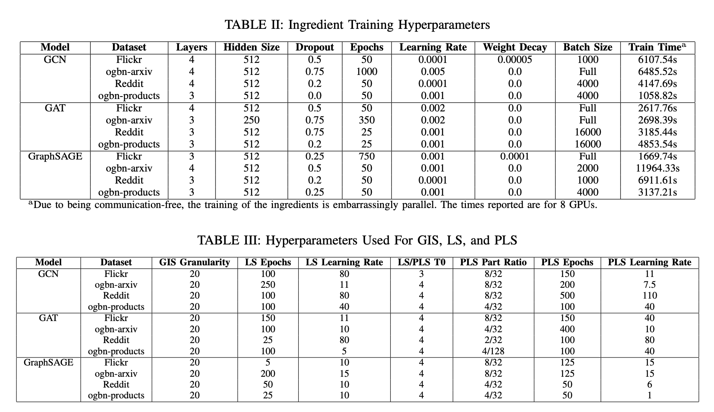

# Enhanced Soups for Graph Neural Networks

## Description

The official implementation of Enhanced Soups for Graph Neural Networks.

## Table of Contents

- [Installation](#installation)
- [Usage](#usage)
- [Contact](#contact)

## Installation

Required packages:
- PyTorch
- DGL
- tqdm
- ogb

Our conda environment can be loaded by using 
```bash
$ conda create --name <env> --file conda_env.txt
```
However this environment contains many unused packages, and the DGL version has a small compatability error with the PyTorch version, so we recommend installing your own.


## Usage

Train ingredients using ingredient_trainer.py by passing in the graph name, model information, and training hyperparameters.
For instance, to train 10 GCN ingredients on the Products dataset and save them in a "gcn_prods" folder:

```bash
python ingredient_trainer.py --graph_name ogbn-products --model_to_use gcn --hidden_layer_size 512 --dropout 0.0 --num_layers 3 --num_to_train 10 --save_directory ./gcn_prods --batch_size 4000 --epochs 50 --learn_rate 0.001 --sampled_neighbors 3
```

Soup ingredients using souping algorithms in soups.py, which take in a list of ingredient paths, an example model (used to determine the model settings to load the ingredients), and the relevant hyperparameters for the algorithm. For example, to run GIS with 20 granularity on our previously trained models in the "gcn_prods" folder and evaluate the result on the test set, we can do the following:

```python
>>> import tools
>>> import soups
>>> directories = [f"./gcn_prods/ingredient_{i}.pt" for i in range(10)]
>>> graph = tools.load_graph_dataset("ogbn-products")
>>> model = tools.create_proper_model(
        graph, 
        "gcn", 
        3, 
        512, 
        0.0
    )
>>> final_sd = soups.greedy_interpolated_soup(
        graph,
        directories,
        model,
        20
    )
>>> model.load_state_dict(final_sd)
>>> test_acc = tools.test(
        graph,
        model
    ).cpu().item()
>>> print(f"Test accuracy of GIS: {round(test_acc*100, 2)}")
```


PLS requires a preprocessing step, where the graph is partitioned using a SOTA partitioning algorithm. This can be done using DGL's distributed library. We also recommend preloading the partitions (which moves them from the disk to memory) and passing them into PLS, rather than letting PLS load the partitions from the disk. The preloaded parts can be kept on the GPU (trading CPU memory for speed) or on the CPU (where they are moved to the GPU during training when they are chosen). Continuing with our example of GCN on Products, we can do the following:

```python
>>> import dgl
>>> import partition as pt
>>> import tools
>>> import soups
>>> directories = [f"./gcn_prods/ingredient_{i}.pt" for i in range(10)]
>>> graph = tools.load_graph_dataset("ogbn-products")
>>> model = tools.create_proper_model(
        graph, 
        "gcn", 
        3, 
        512, 
        0.0
    )
>>> soup_total_parts = 32 #divide the graph into 32 partitions
>>> soup_parts = 4 #select 4 random partitions every epoch to train on
>>> soup_ep = 100 #epochs for PLS
>>> soup_lr = 40 #learning rate for PLS
>>> soup_wd = 0.0 #weight decay for PLS
>>> soup_CAW_T0 = 4 #Cosine Annealing Warm Restarts T0 parameter
>>> dgl.distributed.partition_graph(
        graph, 
        graph_name="ogbn-products", 
        num_parts=soup_total_parts,
        out_path="./gcn_prods",
        balance_ntypes=graph.ndata['val_mask'],
        balance_edges=True,
        return_mapping=False,
        num_hops=1,
        part_method='metis'
    )  
>>> partition_json_path = f'./gcn_prods/ogbn-products.json'
>>> preloaded_parts = pt.preload_partitions(partition_json_path, soup_total_parts)
>>> final_sd = soups.pls(
            directories,
            model,
            soup_ep,                
            soup_lr,                
            soup_wd,                
            'normal',               #initialization for PLS parameters, we propose normal glorot/xavier
            soup_CAW_T0,            
            partition_json_path,
            soup_parts,             
            soup_total_parts,      
            preloaded_parts=preloaded_parts
        )
```

Almost all functions also have a device parameter, be sure to fill this in with the desired CUDA device for the fastest results. Many other tweaks which tradeoff GPU memory usage for time, accuracy, or both can be found throughout for flexibility to suit a desired system.


## Hyperparameters

We chose to use the Cosine Annealing with Warm Restarts as our learning rate scheduler to help encourage our gradient descent approaches to escape local minima. This learning rate scheduler takes T0 as a hyperparameter, which controls how often to perform the warm restarts.

The PLS Part Ratio specifies the ratio of constructed-subgraph partitions to the total partitions the graph was divided into. For example, for GCN on Flickr, the graph was partitioned into 32 parts, and during each epoch of PLS a new subgraph was constructed from 8 of these parts selected at random. 

## Contact

Joseph Zuber
- Email: zubes@iastate.edu
- GitHub: [Zubes01](https://github.com/Zubes01)